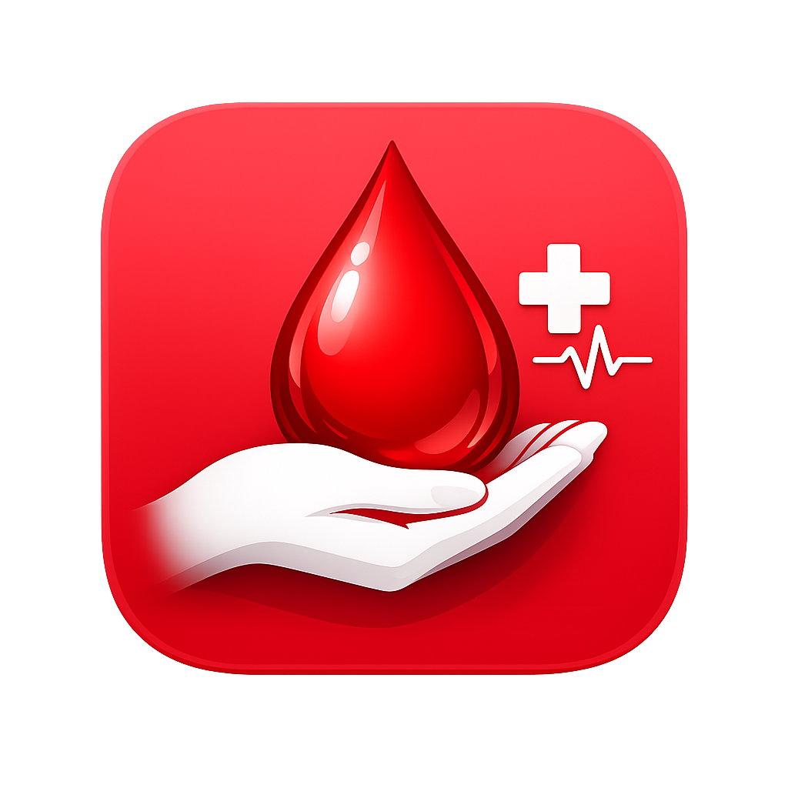

<<<<<<< HEAD
# Rakta-Vahini 🩸




**Rakta-Vahini** is a privacy-focused, high-performance native Android application designed to bridge the gap between blood donors and those in urgent need. Built with modern Android development practices, it provides a seamless, localized, and secure experience for emergency blood donor discovery.

## 🚀 Key Features

- **Privacy-First Directory**: Connects requesters with donors without exposing private contact details publicly.
- **Smart Eligibility Tracking**: Automatically filters donors based on the 90-day donation interval.
- **Emergency Search**: Find donors by blood group and proximity (10km/20km radius).
- **Direct Action**: Integrated dialer support for immediate emergency contact.
- **Multi-language Support**: Fully localized for diverse user bases (English, Kannada, etc.).
- **Material 3 Design**: A modern, premium UI with high accessibility and dynamic color support.

## 🛠️ Technology Stack

- **Language**: Kotlin 1.9.x
- **UI**: Jetpack Compose (Material 3)
- **Architecture**: MVVM + Clean Architecture
- **Local Database**: Room Persistence Library
- **Dependency Injection**: Hilt
- **Async**: Coroutines & Flow
- **Navigation**: Jetpack Navigation Compose

## 📖 Documentation

- [Full Project Specification](docs/SPECIFICATION.md)

## 📱 Screenshots

*Coming Soon...*

## 📥 Getting Started

### Prerequisites
- Android Studio Iguana or newer
- JDK 17+
- Android SDK 26+ (Minimum)

### Installation
1. Clone the repository:
   ```bash
   git clone https://github.com/[your-username]/rakta-vahini.git
   ```
2. Open the project in Android Studio.
3. Sync Project with Gradle Files.
4. Run the app on an emulator or physical device.

## 📄 License

This project is licensed under the MIT License - see the [LICENSE](LICENSE) file for details.

---

Built with ❤️ for a better tomorrow.
=======
# rakta-vahini
Rakta-Vahini – Emergency Blood Search Application
>>>>>>> 26de0d2dc5d313ad587369fc7fd1a3b6ad48d472
